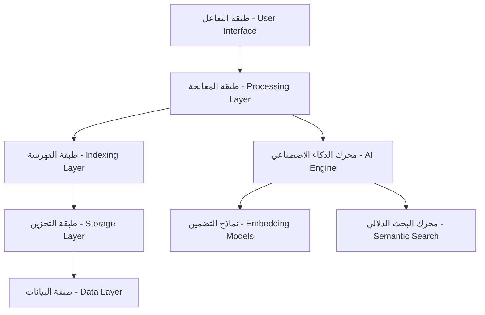

# بناء محرك السياق المتقدم - Context Engine Architecture

## 🎯 نظرة عامة

محرك السياق هو النظام الذكي الذي يجمع ويحلل ويفهم السياق الكامل للكود والمشروع لتقديم مساعدة برمجية دقيقة ومتقدمة. هذا الدليل يوضح كيفية بناء محرك سياق مشابه للذي أستخدمه.

## 🏗️ المعمارية العامة

### 1. طبقات النظام



### 2. المكونات الأساسية

#### أ. جامع السياق (Context Collector)
```typescript
interface ContextCollector {
  // جمع معلومات الملفات والمجلدات
  collectFileStructure(): Promise<FileStructure>
  
  // تحليل التبعيات والاستيرادات
  analyzeDependencies(): Promise<DependencyGraph>
  
  // جمع تاريخ Git والتغييرات
  collectGitHistory(): Promise<GitContext>
  
  // تحليل قاعدة البيانات والنماذج
  analyzeDatabase(): Promise<DatabaseSchema>
}
```

#### ب. محلل الكود (Code Analyzer)
```typescript
interface CodeAnalyzer {
  // تحليل بنية الكود
  parseCodeStructure(filePath: string): Promise<CodeStructure>
  
  // استخراج الرموز والدوال
  extractSymbols(code: string): Promise<Symbol[]>
  
  // تحليل العلاقات بين الملفات
  analyzeRelationships(): Promise<RelationshipMap>
  
  // فهم أنماط التصميم
  detectPatterns(): Promise<DesignPattern[]>
}
```

## 🔍 نظام الفهرسة والبحث

### 3. فهرسة المحتوى

#### أ. فهرسة الملفات
```typescript
class FileIndexer {
  async indexFile(filePath: string): Promise<FileIndex> {
    const content = await fs.readFile(filePath, 'utf-8')
    const ast = this.parseToAST(content)
    const symbols = this.extractSymbols(ast)
    const dependencies = this.analyzeDependencies(ast)
    
    return {
      path: filePath,
      content,
      symbols,
      dependencies,
      lastModified: new Date(),
      hash: this.generateHash(content)
    }
  }
  
  private parseToAST(content: string): AST {
    // استخدام محللات مختلفة حسب نوع الملف
    // TypeScript: typescript compiler API
    // Python: ast module
    // Java: JavaParser
    // etc.
  }
}
```

#### ب. فهرسة قاعدة البيانات
```typescript
class DatabaseIndexer {
  async indexSchema(): Promise<DatabaseIndex> {
    const schema = await this.prisma.introspect()
    const models = this.extractModels(schema)
    const relationships = this.analyzeRelationships(models)
    
    return {
      models,
      relationships,
      constraints: this.extractConstraints(schema),
      indexes: this.extractIndexes(schema)
    }
  }
}
```

### 4. نظام التضمين (Embedding System)

#### أ. تضمين الكود
```typescript
class CodeEmbedding {
  private embeddingModel: EmbeddingModel
  
  async embedCodeSnippet(code: string, context: CodeContext): Promise<Embedding> {
    // تحضير النص للتضمين
    const processedCode = this.preprocessCode(code, context)
    
    // إنشاء التضمين
    const embedding = await this.embeddingModel.embed(processedCode)
    
    return {
      vector: embedding,
      metadata: {
        language: context.language,
        type: context.type,
        symbols: context.symbols
      }
    }
  }
  
  private preprocessCode(code: string, context: CodeContext): string {
    // إزالة التعليقات غير المهمة
    // تطبيع أسماء المتغيرات
    // إضافة معلومات السياق
    return `
      Language: ${context.language}
      Type: ${context.type}
      Context: ${context.description}
      Code: ${code}
    `
  }
}
```

#### ب. قاعدة بيانات المتجهات
```typescript
class VectorDatabase {
  private vectorStore: VectorStore // Pinecone, Weaviate, or Chroma
  
  async storeEmbedding(embedding: Embedding, metadata: any): Promise<string> {
    return await this.vectorStore.upsert({
      id: this.generateId(metadata),
      values: embedding.vector,
      metadata
    })
  }
  
  async searchSimilar(query: string, filters?: any): Promise<SearchResult[]> {
    const queryEmbedding = await this.embeddingModel.embed(query)
    
    return await this.vectorStore.query({
      vector: queryEmbedding,
      topK: 10,
      filter: filters,
      includeMetadata: true
    })
  }
}
```

## 🧠 محرك الذكاء الاصطناعي

### 5. معالج الاستعلامات

```typescript
class QueryProcessor {
  async processQuery(query: string, context: ProjectContext): Promise<ContextualResponse> {
    // 1. تحليل نوع الاستعلام
    const queryType = await this.classifyQuery(query)
    
    // 2. جمع السياق ذي الصلة
    const relevantContext = await this.gatherRelevantContext(query, context)
    
    // 3. ترتيب المعلومات حسب الأهمية
    const rankedContext = this.rankContextByRelevance(relevantContext, query)
    
    // 4. إنشاء الاستجابة
    return await this.generateResponse(query, rankedContext, queryType)
  }
  
  private async classifyQuery(query: string): Promise<QueryType> {
    // تصنيف الاستعلام: code_search, debugging, explanation, implementation
    const classification = await this.aiModel.classify(query, {
      categories: ['code_search', 'debugging', 'explanation', 'implementation', 'refactoring']
    })
    
    return classification.category
  }
}
```

### 6. جامع السياق الذكي

```typescript
class IntelligentContextGatherer {
  async gatherContext(query: string, projectContext: ProjectContext): Promise<ContextBundle> {
    const tasks = await Promise.allSettled([
      this.searchCodebase(query),
      this.searchGitHistory(query),
      this.searchDocumentation(query),
      this.analyzeDependencies(query),
      this.searchDatabaseSchema(query)
    ])
    
    return this.combineResults(tasks)
  }
  
  private async searchCodebase(query: string): Promise<CodeSearchResult[]> {
    // البحث الدلالي في الكود
    const semanticResults = await this.vectorDB.searchSimilar(query, {
      type: 'code'
    })
    
    // البحث النصي التقليدي
    const textResults = await this.textSearch.search(query, {
      fileTypes: ['.ts', '.js', '.py', '.java'],
      includeComments: true
    })
    
    return this.mergeSearchResults(semanticResults, textResults)
  }
}
```

## 📊 نظام التحليلات والتعلم

### 7. تحليل أنماط الاستخدام

```typescript
class UsageAnalyzer {
  async analyzeQueryPatterns(): Promise<QueryInsights> {
    const recentQueries = await this.getRecentQueries()
    
    return {
      commonPatterns: this.extractCommonPatterns(recentQueries),
      frequentTopics: this.identifyFrequentTopics(recentQueries),
      userPreferences: this.analyzeUserPreferences(recentQueries),
      improvementAreas: this.identifyImprovementAreas(recentQueries)
    }
  }
  
  async updateContextModel(feedback: UserFeedback): Promise<void> {
    // تحديث نموذج السياق بناءً على ملاحظات المستخدم
    await this.contextModel.updateWeights(feedback)
    
    // إعادة فهرسة المحتوى المحدث
    if (feedback.requiresReindexing) {
      await this.reindexAffectedContent(feedback.affectedFiles)
    }
  }
}
```

### 8. نظام التحسين التلقائي

```typescript
class AutoOptimizer {
  async optimizeContextRetrieval(): Promise<OptimizationReport> {
    // تحليل أداء البحث
    const performanceMetrics = await this.analyzeSearchPerformance()
    
    // تحسين معاملات البحث
    const optimizedParams = await this.optimizeSearchParameters(performanceMetrics)
    
    // تحديث فهارس البحث
    await this.updateSearchIndexes(optimizedParams)
    
    return {
      improvements: this.calculateImprovements(performanceMetrics),
      newParameters: optimizedParams,
      estimatedSpeedup: this.estimateSpeedup(optimizedParams)
    }
  }
}
```

## 🔧 التكامل مع المشروع الحالي

### 9. تكامل مع Next.js و Prisma

```typescript
// src/lib/context-engine/index.ts
export class EduSparkContextEngine {
  private prisma: PrismaClient
  private vectorDB: VectorDatabase
  private codeAnalyzer: CodeAnalyzer
  
  constructor() {
    this.prisma = new PrismaClient()
    this.vectorDB = new VectorDatabase()
    this.codeAnalyzer = new CodeAnalyzer()
  }
  
  async initialize(): Promise<void> {
    // فهرسة المشروع الحالي
    await this.indexProject()
    
    // تحليل قاعدة البيانات
    await this.analyzeDatabaseSchema()
    
    // إعداد نماذج الذكاء الاصطناعي
    await this.setupAIModels()
  }
  
  async query(request: string, userId?: string): Promise<ContextualResponse> {
    const context = await this.gatherProjectContext()
    const userContext = userId ? await this.getUserContext(userId) : null
    
    return await this.queryProcessor.process(request, {
      project: context,
      user: userContext
    })
  }
}
```

### 10. API Endpoints

```typescript
// src/app/api/context/query/route.ts
export async function POST(request: NextRequest) {
  const { query, context } = await request.json()
  const session = await getServerSession(authOptions)
  
  const contextEngine = new EduSparkContextEngine()
  const response = await contextEngine.query(query, session?.user?.id)
  
  return NextResponse.json(response)
}
```

## 📈 مؤشرات الأداء والجودة

### 11. مقاييس النجاح

```typescript
interface PerformanceMetrics {
  // سرعة الاستجابة
  averageResponseTime: number
  
  // دقة النتائج
  relevanceScore: number
  
  // رضا المستخدم
  userSatisfactionRate: number
  
  // تغطية الكود
  codebaseCoverage: number
  
  // كفاءة الذاكرة
  memoryUsage: number
}
```

## 🛠️ التطبيق العملي

### 12. إعداد البيئة التطويرية

#### أ. التبعيات المطلوبة
```bash
# تثبيت مكتبات معالجة النصوص والذكاء الاصطناعي
npm install @langchain/core @langchain/openai
npm install @pinecone-database/pinecone
npm install @tensorflow/tfjs-node
npm install natural compromise

# مكتبات تحليل الكود
npm install typescript-parser @babel/parser
npm install @typescript-eslint/parser
npm install tree-sitter tree-sitter-typescript

# مكتبات قواعد البيانات المتجهة
npm install chromadb weaviate-ts-client
npm install faiss-node # للبحث المحلي السريع
```

#### ب. هيكل المجلدات
```
src/lib/context-engine/
├── core/
│   ├── collector.ts          # جامع السياق الأساسي
│   ├── analyzer.ts           # محلل الكود والبيانات
│   ├── indexer.ts           # نظام الفهرسة
│   └── processor.ts         # معالج الاستعلامات
├── ai/
│   ├── embeddings.ts        # نظام التضمين
│   ├── models.ts           # نماذج الذكاء الاصطناعي
│   └── search.ts           # محرك البحث الدلالي
├── storage/
│   ├── vector-db.ts        # قاعدة البيانات المتجهة
│   ├── cache.ts           # نظام التخزين المؤقت
│   └── persistence.ts     # حفظ البيانات
├── utils/
│   ├── parsers.ts         # محللات الكود
│   ├── extractors.ts      # مستخرجات المعلومات
│   └── validators.ts      # التحقق من صحة البيانات
└── types/
    ├── context.ts         # أنواع السياق
    ├── search.ts         # أنواع البحث
    └── analysis.ts       # أنواع التحليل
```

### 13. تطبيق محرك السياق للمشروع الحالي

#### أ. تحليل مشروع EduSpark
```typescript
// src/lib/context-engine/analyzers/eduspark-analyzer.ts
export class EduSparkProjectAnalyzer {
  private prisma: PrismaClient

  async analyzeProject(): Promise<ProjectAnalysis> {
    return {
      // تحليل النماذج التعليمية
      educationalModels: await this.analyzeEducationalModels(),

      // تحليل نظام المصادقة
      authSystem: await this.analyzeAuthSystem(),

      // تحليل APIs
      apiEndpoints: await this.analyzeAPIEndpoints(),

      // تحليل نظام الذكاء الاصطناعي
      aiIntegration: await this.analyzeAIIntegration(),

      // تحليل قاعدة البيانات
      databaseSchema: await this.analyzeDatabaseSchema()
    }
  }

  private async analyzeEducationalModels(): Promise<EducationalModelAnalysis> {
    const models = ['Course', 'Lesson', 'Quiz', 'Enrollment']
    const relationships = await this.extractModelRelationships(models)

    return {
      coreModels: models,
      relationships,
      businessLogic: await this.extractBusinessLogic(models),
      validationRules: await this.extractValidationRules(models)
    }
  }

  private async analyzeAIIntegration(): Promise<AIIntegrationAnalysis> {
    const aiFiles = [
      'src/lib/openai.ts',
      'src/lib/socratic-questions.ts',
      'src/lib/marjan-prompts.ts',
      'src/app/api/ai/**/*.ts'
    ]

    return {
      aiProviders: ['Gemini', 'OpenAI'],
      integrationPoints: await this.findAIIntegrationPoints(aiFiles),
      promptTemplates: await this.extractPromptTemplates(aiFiles),
      usagePatterns: await this.analyzeAIUsagePatterns()
    }
  }
}
```

#### ب. فهرسة المحتوى التعليمي
```typescript
// src/lib/context-engine/indexers/content-indexer.ts
export class EducationalContentIndexer {
  async indexEducationalContent(): Promise<ContentIndex> {
    const courses = await this.prisma.course.findMany({
      include: {
        lessons: {
          include: {
            quizzes: {
              include: {
                questions: {
                  include: {
                    options: true
                  }
                }
              }
            }
          }
        },
        categories: true
      }
    })

    const contentEmbeddings = await Promise.all(
      courses.map(course => this.createCourseEmbedding(course))
    )

    return {
      totalCourses: courses.length,
      embeddings: contentEmbeddings,
      categories: this.extractCategories(courses),
      topics: this.extractTopics(courses)
    }
  }

  private async createCourseEmbedding(course: any): Promise<CourseEmbedding> {
    const courseText = this.prepareCourseText(course)
    const embedding = await this.embeddingModel.embed(courseText)

    return {
      courseId: course.id,
      title: course.title,
      embedding: embedding,
      metadata: {
        level: course.level,
        duration: course.duration,
        lessonCount: course.lessons.length,
        categories: course.categories.map(c => c.name)
      }
    }
  }
}
```

### 14. نظام البحث الذكي المتقدم

#### أ. البحث متعدد الطبقات
```typescript
// src/lib/context-engine/search/multi-layer-search.ts
export class MultiLayerSearch {
  async search(query: string, context: SearchContext): Promise<SearchResults> {
    // الطبقة الأولى: البحث الدلالي
    const semanticResults = await this.semanticSearch(query, context)

    // الطبقة الثانية: البحث في الكود
    const codeResults = await this.codeSearch(query, context)

    // الطبقة الثالثة: البحث في التاريخ
    const historyResults = await this.gitHistorySearch(query, context)

    // الطبقة الرابعة: البحث في قاعدة البيانات
    const dbResults = await this.databaseSearch(query, context)

    // دمج وترتيب النتائج
    return this.mergeAndRankResults([
      semanticResults,
      codeResults,
      historyResults,
      dbResults
    ], query)
  }

  private async semanticSearch(query: string, context: SearchContext): Promise<SearchResult[]> {
    // تحويل الاستعلام إلى متجه
    const queryEmbedding = await this.embeddingModel.embed(query)

    // البحث في قاعدة البيانات المتجهة
    const vectorResults = await this.vectorDB.search(queryEmbedding, {
      topK: 20,
      filter: this.buildContextFilter(context)
    })

    return vectorResults.map(result => ({
      type: 'semantic',
      content: result.metadata.content,
      score: result.score,
      source: result.metadata.source,
      context: result.metadata.context
    }))
  }
}
```

#### ب. نظام الترتيب الذكي
```typescript
// src/lib/context-engine/ranking/intelligent-ranker.ts
export class IntelligentRanker {
  async rankResults(results: SearchResult[], query: string, userContext: UserContext): Promise<RankedResult[]> {
    const scoredResults = await Promise.all(
      results.map(result => this.scoreResult(result, query, userContext))
    )

    return scoredResults
      .sort((a, b) => b.finalScore - a.finalScore)
      .slice(0, 10) // أفضل 10 نتائج
  }

  private async scoreResult(result: SearchResult, query: string, userContext: UserContext): Promise<RankedResult> {
    const scores = {
      // درجة التشابه الدلالي
      semantic: await this.calculateSemanticSimilarity(result.content, query),

      // درجة الصلة بالسياق
      contextual: this.calculateContextualRelevance(result, userContext),

      // درجة الحداثة
      recency: this.calculateRecencyScore(result.timestamp),

      // درجة الشعبية/الاستخدام
      popularity: await this.calculatePopularityScore(result.source),

      // درجة الجودة
      quality: await this.calculateQualityScore(result)
    }

    const finalScore = this.weightedAverage(scores, {
      semantic: 0.4,
      contextual: 0.3,
      recency: 0.1,
      popularity: 0.1,
      quality: 0.1
    })

    return {
      ...result,
      scores,
      finalScore
    }
  }
}
```

### 15. نظام التعلم والتحسين

#### أ. التعلم من التفاعلات
```typescript
// src/lib/context-engine/learning/interaction-learner.ts
export class InteractionLearner {
  async learnFromInteraction(interaction: UserInteraction): Promise<void> {
    // تحليل نجاح الاستجابة
    const success = await this.evaluateInteractionSuccess(interaction)

    if (success.wasHelpful) {
      // تعزيز الأنماط الناجحة
      await this.reinforceSuccessfulPatterns(interaction)
    } else {
      // تحليل أسباب الفشل وتحسين النظام
      await this.analyzeFailureAndImprove(interaction, success.feedback)
    }

    // تحديث نماذج التعلم
    await this.updateLearningModels(interaction, success)
  }

  private async reinforceSuccessfulPatterns(interaction: UserInteraction): Promise<void> {
    // زيادة وزن الأنماط الناجحة
    const patterns = this.extractPatterns(interaction)

    for (const pattern of patterns) {
      await this.patternWeights.increase(pattern.id, 0.1)
    }

    // تحديث نموذج الترتيب
    await this.rankingModel.updateWeights(interaction.query, interaction.results, 'positive')
  }
}
```

#### ب. التحسين التلقائي
```typescript
// src/lib/context-engine/optimization/auto-optimizer.ts
export class AutoOptimizer {
  async runOptimizationCycle(): Promise<OptimizationReport> {
    const report: OptimizationReport = {
      timestamp: new Date(),
      optimizations: []
    }

    // تحسين فهارس البحث
    const indexOptimization = await this.optimizeSearchIndexes()
    report.optimizations.push(indexOptimization)

    // تحسين نماذج التضمين
    const embeddingOptimization = await this.optimizeEmbeddingModels()
    report.optimizations.push(embeddingOptimization)

    // تحسين خوارزميات الترتيب
    const rankingOptimization = await this.optimizeRankingAlgorithms()
    report.optimizations.push(rankingOptimization)

    // تنظيف البيانات القديمة
    const cleanupOptimization = await this.cleanupOldData()
    report.optimizations.push(cleanupOptimization)

    return report
  }
}
```

---

## 🚀 خطة التطبيق المرحلية

### المرحلة الأولى (الأسابيع 1-2): الأساسيات
- [ ] إعداد البنية التحتية الأساسية
- [ ] تطبيق جامع السياق البسيط
- [ ] إنشاء نظام فهرسة أولي
- [ ] تكامل مع قاعدة بيانات متجهة بسيطة

### المرحلة الثانية (الأسابيع 3-4): البحث الذكي
- [ ] تطبيق نظام التضمين
- [ ] إنشاء محرك البحث الدلالي
- [ ] تطوير نظام الترتيب الأولي
- [ ] اختبار الأداء والدقة

### المرحلة الثالثة (الأسابيع 5-6): التحسين والتعلم
- [ ] إضافة نظام التعلم من التفاعلات
- [ ] تطوير خوارزميات التحسين التلقائي
- [ ] تحسين الأداء والسرعة
- [ ] إضافة مقاييس الجودة

### المرحلة الرابعة (الأسابيع 7-8): التكامل والاختبار
- [ ] تكامل كامل مع مشروع EduSpark
- [ ] اختبار شامل للنظام
- [ ] تحسين واجهة المستخدم
- [ ] توثيق شامل للنظام

---

*هذا دليل شامل لبناء محرك سياق متقدم. يمكن تطبيقه تدريجياً حسب الاحتياجات والموارد المتاحة.*
